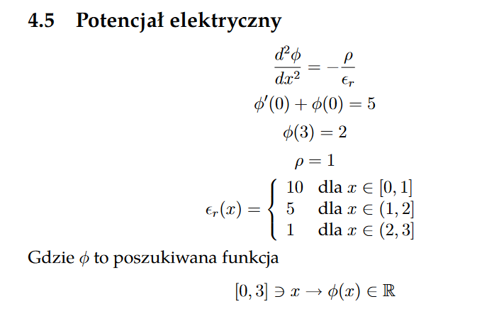

# Electric potential FEM
Program computes differential equation for electric potential using Finite Element Method (FEM) for given n elements and draw result on the plot. It was made as a final project on Differential Equations course on AGH University of Kraków.

 